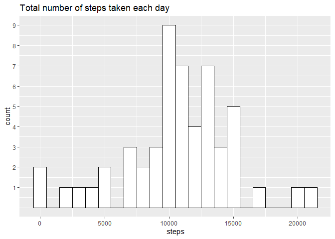
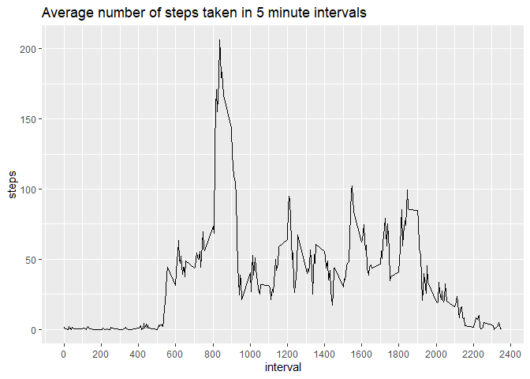
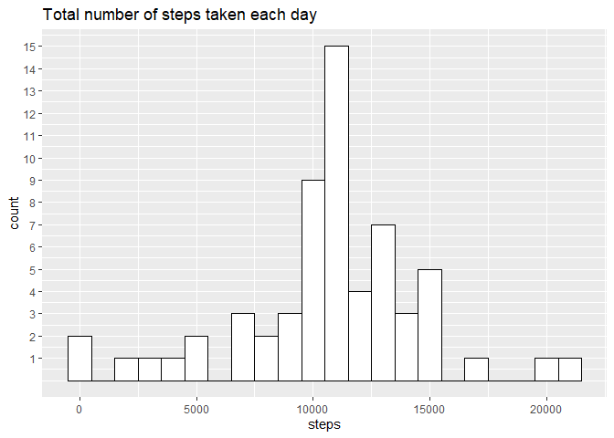
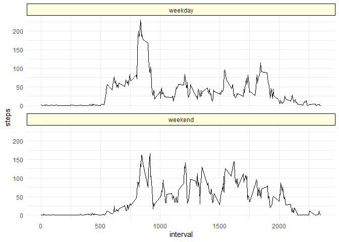

## Loading and preprocessing the data
Let's load all the libraries

``` r
library(plyr)
library(dplyr)
library(ggplot2)
library(lubridate)
```

and all the data needed

``` r
if (!file.exists("activity.csv")) {unzip("./activity.zip")}
act=read.csv("activity.csv")
act$date=as.Date(act$date,"%Y-%m-%d") #Converting variable date to Date class
```


## What is mean total number of steps taken per day?
First, let's group the data by day, summing all the steps taken in the day.

``` r
daysteps=act %>% group_by(date) %>% summarise(steps=sum(steps))
```

Then create a histogram of the total number of steps taken each day

``` r
ggplot(daysteps,aes(steps))+
    geom_histogram(binwidth=1000,color="black", fill="white")+
    scale_y_continuous(breaks=1:9)+
    ggtitle("Total number of steps taken each day")
```

```
## Warning: Removed 8 rows containing non-finite outside the scale range (`stat_bin()`).
```

<!-- -->

Lastly, let's find the mean and median of the data.

``` r
c(mean.steps=mean(daysteps$steps,na.rm = T),
  median.steps=median(daysteps$steps,na.rm = T))
```

```
##   mean.steps median.steps 
##     10766.19     10765.00
```
The mean is slightly higher than the median, which results in a slight positive skewness in the data distribution.


## What is the average daily activity pattern?
First, let's group the data by interval, finding average steps taken in each 5 minute interval.

``` r
timesteps=act %>% group_by(interval)%>% summarise(steps=mean(steps,na.rm=T))
```


Then create a plot of the average number of steps taken each interval

``` r
ggplot(timesteps,aes(interval,steps))+
    geom_line()+
    scale_x_continuous(breaks=seq(0, 2400, 200))+
    ggtitle("Average number of steps taken in 5 minute intervals")
```

<!-- -->

Lastly, let's find which interval contains, on average, the maximum number of steps.

``` r
timesteps[which(timesteps$steps==max(timesteps$steps)),1]
```

```
## # A tibble: 1 × 1
##   interval
##      <int>
## 1      835
```
The interval 835-840 has the maximum number of steps. 


## Imputing missing values
Let's calculate the number of NAs in the data

``` r
sum(is.na(act$steps))
```

```
## [1] 2304
```
There is a total of 2304 NAs in the date, which is high. 
Let's replace the NAs with the average number of steps taken in the corresponding interval.

``` r
noNA=join(act[is.na(act$steps),c("date","interval")],timesteps,by="interval")
act2=act
act2[is.na(act$steps),]$steps=noNA$steps
```

Now that we have a new data frame with the NAs replaced, we are going to group the data by day summing all the steps taken in the day.  

``` r
daysteps2=act2 %>% group_by(date) %>% summarise(steps=sum(steps))
```

Plot a histogram like the one before, but with the NAs replaced, to see the changes in the data distribution. 

``` r
ggplot(daysteps2,aes(steps))+
    geom_histogram(binwidth=1000,color="black", fill="white")+
    scale_y_continuous(breaks=1:15)+
    ggtitle("Total number of steps taken each day")
```

<!-- -->

We also find the mean and median.

``` r
c(mean.steps2=mean(daysteps2$steps,na.rm = T),
  median.steps2=median(daysteps2$steps,na.rm = T))
```

```
##   mean.steps2 median.steps2 
##      10766.19      10766.19
```
We notice that the values differ from the first assignment. The mean and the median are now equal values, which results in a normally distributed data.


## Are there differences in activity patterns between weekdays and weekends?
First we create a data frame with a column that details if the date corresponds to a weekday or a weekend (wdwe).  

``` r
wdwe=wday(act2[,2],week_start = 1)
wdwe=gsub("[1-5]","weekday",wdwe)
wdwe=gsub("[6-7]","weekend",wdwe)
wdwe=as.factor(wdwe)
act2=cbind(act2,wdwe)
```

Then we group the steps by wdwe and by interval, averaging the steps. 

``` r
weeksteps=act2 %>% group_by(wdwe,interval) %>% summarise(steps=mean(steps))
```

```
## `summarise()` has grouped output by 'wdwe'. You can override using the `.groups` argument.
```

Finally, we plot the average number of steps taken in each 5 minute interval of a weekday or a weekend. 

``` r
ggplot(weeksteps,aes(interval,steps))+
    geom_line(color="black")+
    facet_wrap(~wdwe,ncol=1)+
    theme_minimal()+
    theme(strip.background = element_rect(fill = "lightyellow", color = "black"))
```

<!-- -->

We notice that the average number of steps taken in a weekday or weekend differ. During weekdays, around the 800-900 minute interval, there is a marked increase in the number of steps taken,compared to weekends, where there is no such increase.


